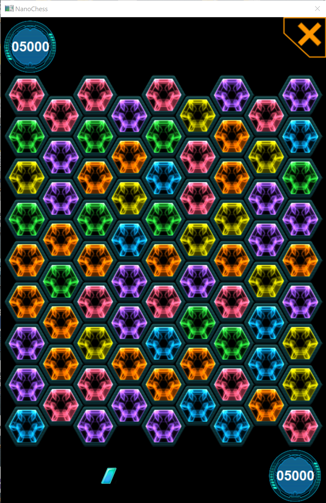
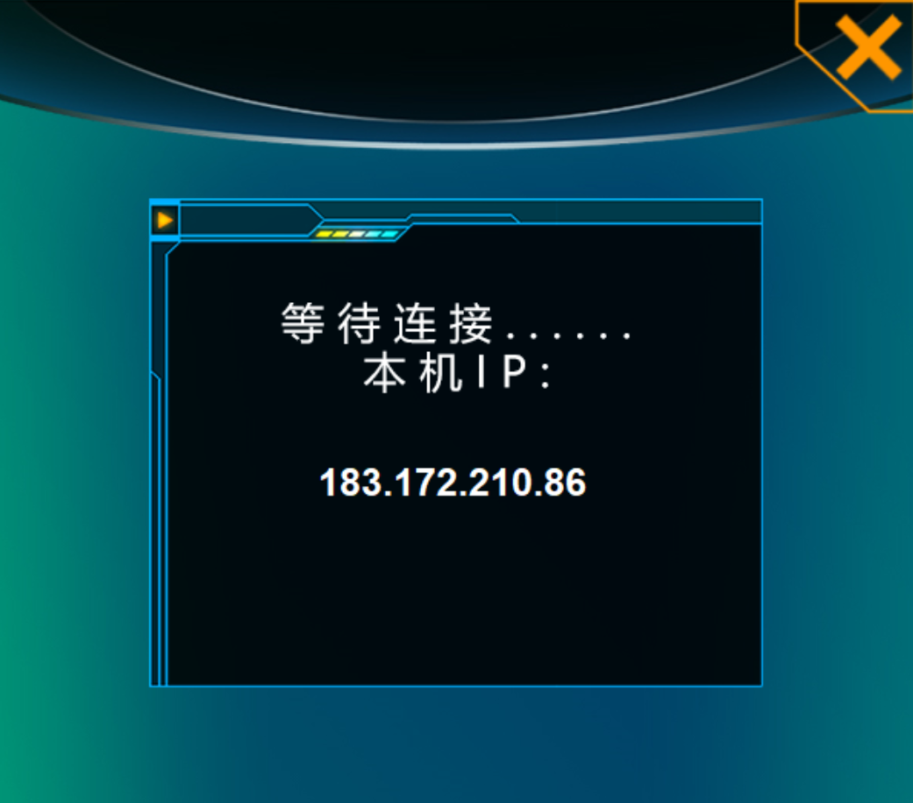

# 灵动棋游戏说明文档

## 小组成员

组长：桂阿璨    组员: 牛浩宇 侯博镡

## 开发环境

- 操作系统：Windows10系统

- ide: Visual Studio

- 汇编器: MASM

## 版本控制

小组成员利用Github进行协同开发。

github仓库地址：

- https://github.com/Haurchefant-G/NanoChess-assembly

## 游戏简介

游戏名叫灵动棋，原本为一款手机游戏，本项目采用汇编语言+win32实现了该游戏，并增加了联机功能。

游戏玩法类似消消乐，但也有不少有趣的特点：

1. 游戏棋盘为77个六边形棋子构成，每个棋子与6个棋子相邻，棋盘中共有6种不同颜色的棋子；
   
   

2. 对战双方轮流获得下棋权，在自己的下棋权时，玩家可以点击相邻的两个棋子交换；

3. 若交换后不存在连续三个及以上相同颜色的棋子在一条直线上，则会将棋子又交换回去，玩家可以重新选择交换；

4. 若交换后有连续三个及以上相同颜色的棋子在一条直线上，则将消除这些攻击对方，扣除对方分数，消除的棋子处会随机填充新颜色的棋子；

5. 交换消除一条线上的棋子时，除了两端，中间位置的填充的新棋子会具有炸弹道具，带有炸弹道具的棋子会在消除时爆炸消去周边6个棋子，若周边6棋子也带有炸弹，则会连续引爆；
   
   
   
   <center>炸弹</center>

6. 交换消除并随机填充后，若棋盘存在连续三个及以上相同颜色的棋子在一条直线上，会继续触发消除，直到棋盘上不存在连续三个及以上相同颜色的棋子在一条直线上，然后轮到另一方玩家操作；

7. 双方初始分数为5000分，当一方分数扣至0时游戏结束，分数不为0的一方获得游戏胜利。
   
   

本游戏可以与内置AI对战，也可以通过网络ip地址与其他玩家对战。

游戏具有恰到好处的背景音乐和操作音效，为玩家提供更好的沉浸式体验。

## 实现原理、难点与创新

### 1. 游戏界面绘制

游戏中采用的图片素材格式为jpg和png，部分为从原版手机游戏解包提取修改，部分为自己制作。

由于gdi绘图仅支持BMP格式，绘制效果较差（png转位图失去透明度容易产生毛边），我们采用了gdiplus绘图（支持包含透明度信息的图片），直接绘制jpg与png图片，获得了更好的显示效果。


通过双缓冲绘图的机制，避免了窗口图像的闪烁。

通过随时间变化的控制图片缩放和位置，利用少量的图片素材实现了较好的动画效果，让整个游戏更加生动，画面更具动感。


<center>炸弹特效</center>

### 2. 界面交互

在不同的程序场景界面下，通过判断鼠标点击位置，来判断程序应该执行何种操作，控制游戏流程。

在棋盘中，我方回合点击棋子时，会有相应的选中效果，提示我方选择到了哪个棋子。

在连接远程玩家对战时，还可以通过键盘输入对方ip地址（支持输入0-9数字与“.”字符），输入内容会显示到界面上。


### 3. 棋盘初始化与更新

这一部分是整个游戏的底层逻辑部分，主要包含：刚开始时的棋盘初始化、每一步操作后检测全局是否存在可以消除的三连元素、以及对三连元素的属性依照游戏规则进行更新三个部分。

首先，每一局游戏刚开始时都会调用`InitializeBoard`函数，完成对整个棋盘的初始化。这一步的难点在于随着初始化过程的进行，我们需要动态地扫描之前的相关元素，保证不会出现可以三消的情况。也就是说，我们需要在考虑各种边界位置的情况下，保证每个元素和它之前初始化的相邻元素都不能有连续三个乃至更多相同颜色的元素。此外，我在刚开始获取随机数的时候使用了系统的`GetTickCount`作为随机数种子，但后来发现因为程序运行速度太快导致随机数没有变化，于是经过多方查阅资料，使用了MASM32内置的nrandom函数，取得了良好的初始化效果。

```nasm
InitializeBoard PROC uses eax ecx edx
    ; 清空棋盘
    ; 随机初始化整个棋盘，要求不能有三连元素
        ; 数组里index = 0 2 4 6 8是第一行棋子 10 12 14 16是第二行棋子（数组一
        ; 行9个）
        ; 从而每个棋子和周围6个棋子的index的差值为-18 -10 -8 +8 +10 +18
        ; 规定颜色有1,2,3,4,5,6六种
        ; 如果是前两行，不需要检测
        ; 编号36之前的节点（第3/4行）不需要向上方检测
        ; 此外，如果是前两列（17行9列），只需要向正上方和右上方检测
        ; 如果是第7/8列，需要向左上和正上方检测
        ; 其余情况需要向左上、正上、右上三个方向检测
```

其次，在整个游戏的运行过程中，不论是玩家还是AI进行操作后，我们都需要对当前的棋盘进行扫描和逻辑判断，以确定当前棋盘是否存在可以消除的连续同颜色元素。对此，我实现了`InspectAndResolveContinuousCells`函数：它首先扫描整个棋盘并找到每次全局最长的可以消除的元素组合，如果不存在的话就返回`eax=0`表示当前没有可三消的元素，即无效操作；如果存在可消除的元素的话，就首先检测并触发要消除的一系列元素内部的炸弹（注意这里很可能会有递归触发），然后再按照游戏规则，将三/四/五连元素的中间一/二/三个元素位置变为同颜色的炸弹，并随机刷新剩下元素的颜色，最后返回`eax=被更新元素的个数`。

```nasm
InspectAndResolveContinuousCells PROC    
    ; 遍历整个棋盘，查看是否存在三/四/五连的连续同颜色元素（只处理一次，不递归处理！）
    ; 若存在连续同颜色元素，把中间的赋为炸弹，剩下的全部随机赋值到m_newColor（为连续
    ; 效果不避免重复，因而需要多次调用），且返回eax=shuffleCount，即消掉元素的准确
    ; 个数
    ; 若整个棋盘都不存在连续同颜色元素了，返回eax=0
    ; 注意：调用一次就需要绘制一次新棋盘，且要重复此过程直至确保不存在连续元素为止（即
    ; 返回的eax为0）
```

在具体的代码实践中，这里的难点和上面类似，需要在考虑各种边界情况下考虑到所有的可能情况而不能出bug，因而需要许多分支和判断来考虑不同的情况。此外，出于增强游戏效果和玩家爽感的考虑，我们在每一次更新棋盘时只会对一个可以连续消除的序列进行处理并进行绘制，这样可以让玩家直观地体验到一步操作引发多步连锁反应，从而消除掉一大片元素的快乐（炸弹连锁触发除外，这需要在一次更新内结束，并且使用了递归实现）。最后，为了简化代码逻辑，我也进行了一定程度的封装，如将常用方法`RandomShuffleByBomb`单独抽象出来作为一个函数，有利于代码复用。

### 4. 游戏对战AI

一般的AI都是依靠多层的搜索实现的，但在本游戏中，由于每次交换棋子之后会随机补充新的棋子，所以我们无法知道第二步及以后的棋盘信息，更别说预测了。为此我们试采用朴实无华的贪心算法来实现对战AI。

贪心算法枚举可行交换的复杂度是O(n)，考虑到棋盘共有77个棋子即n=77，每个棋子的可移动步骤<=6，故其规模足够小我们可枚举所有可行交换步骤。通过枚举的方式，我们可以找到交换后得分最高的一组可行交换作为本次AI的交换选择。

对于每个可行交换的得分，由于交换前棋盘上各处都没有3连默认得分为0，故我们主要考虑其交换后的两个棋子处的分数，即`Grade`函数所实现功能。对交换的每个棋子，判断其各个方向上相连的同色棋子个数，并记录其中炸弹的个数，以此计算得分，即`Count`函数所实现功能。将两个棋子的分数相加即可得该交换的分数。我们可以通过调整相连和炸弹的分数来使AI有更好的选择，实际测试中AI也有着不俗的表现。

### 5. 联机对战

为实现联机对战，我们采用一个简单的TCP连接来让双方玩家通信，该连接在一个新线程中维持，因而通信中各种过程不会阻塞游戏窗口。通信过程具体如图。


联机对战中，发起挑战方将具有先手权。

我们将发起对战的一方看做是服务器，调用`server_socket`函数。

将连接挑战的一方看做是客户端，调用`client_socket`函数。

服务器在准备等待客户端连接前，与'8.8.8.8'连接获得本机的外网ip后，让其显示在游戏界面上，客户端可通过这个ip地址与服务器连接对战（发起对战玩家将显示的ip告诉连接的玩家）。



之后服务器执行建立socket等一系列操作进入listen状态，等待客户端输入服务器ip后建立socket与服务器连接。

在建立连接后，服务器进入发送状态，客户端进入读取状态。服务器首先将自己的初始化棋盘信息发送给客户端，使其完成初始化。之后，服务器执行交换棋子的操作并将交换棋子的信息及对应棋盘消除补充的信息发送给客户端。考虑到交换棋子之后会出现连锁效应，即多次消除补充，为了保证客户端能看到完整的过程，每次服务器端发生消除补充操作时都会给客户端发送棋盘信息。当所有消除补充操作结束后，服务器会发送一个终止符并结束自己的发送状态，而客户端在收到终止符后也会结束自己的读取状态。直到客户端进行交换棋子操作后，客户端进入发送状态，服务器端进入读取状态并重复上述操作流程。最终某一方获胜，服务器端和客户端将自己的连接关闭，等待对战。

联机对战中，消除棋子位置的随机补充将有当前具有下棋权的一方的程序完成。

建立连接后的具体读写流程如图。


### 6. 背景音乐与各式音效

在游戏中，我们不仅为棋盘界面与其他界面配上了不同的BGM，同时对于点击按钮，棋盘中棋子点击，交换，炸弹爆炸及下棋权更替等都配上了相应的音效，丰富玩家的游戏体验。

音效的实现主要依靠win32 API中的mciSendString函数。我们设定在不同界面时，会自动关闭之前的打开的音频文件、打开当前界面的音频文件并循环播放。以此实现背景音乐。

在游戏界面中，为了实现特定的音效，我们在进行特定操作时创建新的线程并播放相应的音效。但后经测试，发现mciSendString函数实际在实现时就采用的是创建新线程的方式，无需我们手动创建线程，故可直接调用。

## 游戏运行效果

游戏运行效果可见视频文件“人机对战.mp4”与"联机对战.mp4"，视频配有部分介绍与讲解。

## 小组分工

* 大作业选题与总体架构思路：小组共同讨论完成
* 桂阿璨：游戏界面，键鼠交互，游戏主程序逻辑，联机对战功能，同时作为组长分配组内工作安排
* 牛浩宇：棋盘数据初始化，棋盘消除判断，棋盘更新填充
* 侯博镡：游戏内置对战AI，音乐音效，联机对战功能
