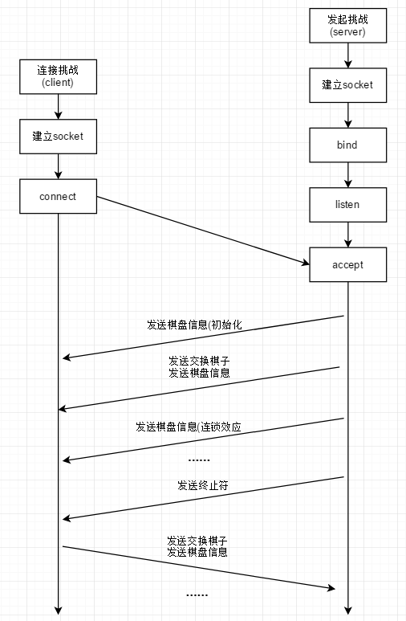

# 汇编与编译原理 第一次小组作业

## 开发环境

参照了助教所给配置环境的教程，本次小组作业全程在Windows10系统下使用Visual Studio开发完成，汇编器是MASM，此外还使用了一些外部库如OpenGL32,MASM32等。

此外，由于小组内三名成员的课表和时间安排互不相同，我们选择了git + GitHub作为版本控制和代码同步系统，其效果表现也很好。具体地，GitHub项目和所有提交记录可参见 https://github.com/Haurchefant-G/NanoChess-assembly .（Private项目，将会于大作业提交后公开）

## 游戏简介

我们实现的游戏是常见的消消乐的改进版，具体地：

1. 将地图由矩形改为了六边形，每个格子都有六个相邻的格子，引入了更多的可能性和更高的操作复杂度。
2. 玩家可以点击相邻的两个格子以交换相邻的两个元素的位置。
3. 交换后连续三/四/五个相同颜色的元素将触发消除，得分并随机变成新的颜色，并且中间的一/二/三格将变成炸弹元素，下一次因三消或旁边炸弹爆炸而触发时，将消除它周围一圈的六个元素。
4. 游戏配有AI与玩家自动对战，得分率先达到一定阈值的角色赢得胜利！（TODO：待补充）
5. 游戏配有恰到好处的背景音乐和操作音效，为玩家提供更好的沉浸式体验。（TODO：待补充）

## 实现原理、难点与创新

### 1. 游戏界面绘制（与XXX）（by 桂阿璨）（TODO：待补充）

（TODO：待补充）

### 2. 棋盘初始化与核心更新逻辑（by 牛浩宇）

这一部分是整个游戏的基础和核心逻辑部分，主要包含：刚开始时的棋盘初始化、每一步操作后检测全局是否存在可以消除的三连元素、以及对三连元素的属性依照游戏规则进行更新三个部分。

首先，每一局游戏刚开始时都会调用`InitializeBoard`函数，完成对整个棋盘的初始化。这一步的难点在于随着初始化过程的进行，我们需要动态地扫描之前的相关元素，保证不会出现可以三消的情况。也就是说，我们需要在考虑各种边界位置的情况下，保证每个元素和它之前初始化的相邻元素都不能有连续三个乃至更多相同颜色的元素。此外，我在刚开始获取随机数的时候使用了系统的`GetTickCount`作为随机数种子，但后来发现因为程序运行速度太快导致随机数没有变化，于是经过多方查阅资料，使用了MASM32内置的nrandom函数，取得了良好的初始化效果。

InitializeBoard函数节选（行数编号为文档写作时结果，仅供参考）
 

其次，在整个游戏的运行过程中，不论是玩家还是AI进行操作后，我们都需要对当前的棋盘进行扫描和逻辑判断，以确定当前棋盘是否存在可以消除的连续同颜色元素。对此，我实现了`InspectAndResolveContinuousCells`函数：它首先扫描整个棋盘并找到每次全局最长的可以消除的元素组合，如果不存在的话就返回`eax=0`表示当前没有可三消的元素，即无效操作；如果存在可消除的元素的话，就首先检测并触发要消除的一系列元素内部的炸弹（注意这里很可能会有递归触发），然后再按照游戏规则，将三/四/五连元素的中间一/二/三个元素位置变为同颜色的炸弹，并随机刷新剩下元素的颜色，最后返回`eax=被更新元素的个数`。

InspectAndResolveContinuousCells函数节选（行数编号为文档写作时结果，仅供参考）
 

在具体的代码实践中，这里的难点和上面类似，需要在考虑各种边界情况下考虑到所有的可能情况而不能出bug，因而需要许多分支和判断来考虑不同的情况。此外，出于增强游戏效果和玩家爽感的考虑，我们在每一次更新棋盘时只会对一个可以连续消除的序列进行处理并进行绘制，这样可以让玩家直观地体验到一步操作引发多步连锁反应，从而消除掉一大片元素的快乐（炸弹连锁触发除外，这需要在一次更新内结束，并且使用了递归实现）。最后，为了简化代码逻辑，我也进行了一定程度的封装，如将常用方法`RandomShuffleByBomb`单独抽象出来作为一个函数，有利于代码复用。

RandomShuffleByBomb函数节选（行数编号为文档写作时结果，仅供参考）
 

### 3. 游戏对战AI（by 侯博镡）

一般的AI都是依靠多层的搜索实现的，但在消消乐中，由于每次交换棋子之后会随机补充新的棋子，所以我们无法知道第二步及以后的棋盘信息，更别说预测了。为此我们试采用朴实无华的贪心算法来实现对战AI。

贪心算法枚举可行交换的复杂度是O(n)，考虑到棋盘共有77个棋子即n=77，每个棋子的可移动步骤<=6，故其规模足够小我们可枚举所有可行交换步骤。通过枚举的方式，我们可以找到交换后得分最高的一组可行交换作为本次AI的交换选择。

对于每个可行交换的得分，由于交换前棋盘上各处都没有3连默认得分为0，故我们主要考虑其交换后的两个棋子处的分数，即`Grade`函数所实现功能。对交换的每个棋子，判断其各个方向上相连的同色棋子个数，并记录其中炸弹的个数，以此计算得分，即`Count`函数所实现功能。将两个棋子的分数相加即可得该交换的分数。我们可以通过调整相连和炸弹的分数来使AI有更好的选择，实际测试中AI也有着不俗的表现。

### 4. 联机对战（by 侯博镡 and 桂阿璨）
为实现联机对战，我们采用一个简单的TCP方式，具体如下图。

### 5. 音效（by 侯博镡）
音效的实现主要依靠win32 API中的mciSendString函数。我们设定在不同界面时，会自动关闭之前的打开的音频文件、打开当前界面的音频文件并循环播放。以此实现背景音乐。

在游戏界面中，为了实现特定的音效，我们在进行特定操作时创建新的线程并播放相应的音效。但后经测试，发现mciSendString函数实际在实现时就采用的是创建新线程的方式，无需我们手动
创建线程，故可直接调用。

## 游戏运行效果Demo

（TODO：待补充）

## 小组分工

* 大作业选题与总体架构思路：小组共同讨论完成
* 游戏界面绘制（与XXX）：由桂阿璨同学负责。此外，桂阿璨同学还负责统筹小组内进度。（TODO：待补充）
* 棋盘初始化与核心更新逻辑：由牛浩宇同学负责。
* 游戏对战AI：由侯博镡同学负责。
* 联机对战：由侯博镡和桂阿璨同学负责。
* 音效：由侯博镡同学负责。
* 游戏打包发布：（TODO：待补充）
* 文档写作：README由XXX同学完成，本说明文档中各部分的实现原理、难点与创新由负责对应部分的同学写作，运行效果Demo部分由XXX同学完成，剩余内容由牛浩宇同学完成。

 
大作业说明文档至此结束，感谢助教/老师的耐心阅读！
